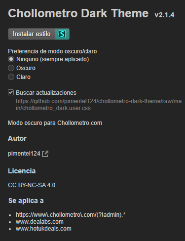
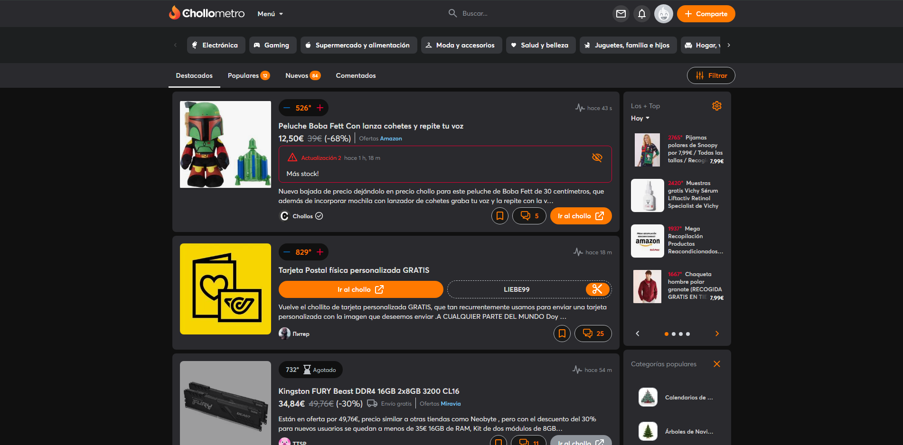
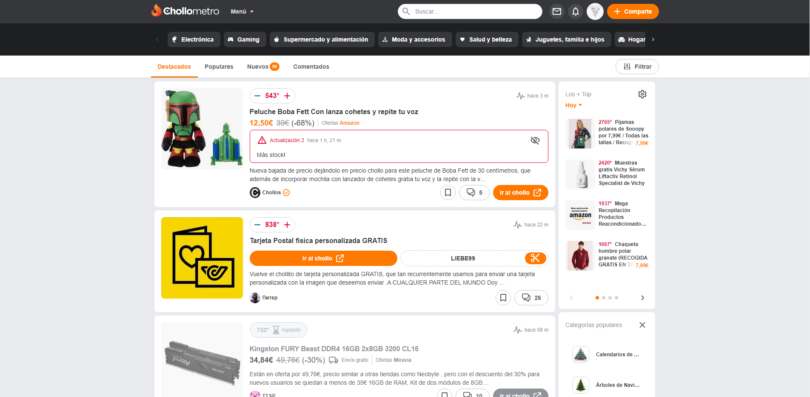

# Estilo CSS modo oscuro Chollometro

Tomando de referencia el trabajo del compañero [Rafitamolin](https://github.com/rafitamolin/chollometro-dark-theme) he decidido crear mi propia versión del estilo oscuro para la web de Chollometro así mismo como otros dos estilos más.

## Instalación

Para instalar los estilos es necesario tener instalado el plugin [Stylus](https://add0n.com/stylus.html) en el navegador.

* [Chrome](https://chrome.google.com/webstore/detail/stylus/clngdbkpkpeebahjckkjfobafhncgmne)
* [Firefox](https://addons.mozilla.org/es/firefox/addon/styl-us/)
* [Opera add-ons](https://addons.opera.com/extensions/details/stylus/)

Una vez instalada la extensión únicamente basta con hacer click en cualquiera de los enlaces de los estilos que se encuentran más abajo. Una vez hecho esto se abrirá una nueva pestaña con el estilo seleccionado, solo basta con hacer click en el botón situado en la parte superior izquierda `Install style` y listo.  

 

## Estilos

* [Dark Original](https://github.com/pimentel124/chollometro-dark-theme/raw/main/chollometro_dark.user.css): Este estilo cambia tanto la apariencia de la web como el tipo de letra.
* [Dark New Font](https://github.com/pimentel124/chollometro-dark-theme/raw/main/chollometro_dark_newFont.user.css): Este estilo cambia la apariencia de la web pero no el tipo de letra.
* [Tipo de letra original](https://github.com/pimentel124/chollometro-dark-theme/raw/main/chollometro_onlyfont.user.css): Este estilo solo cambia el tipo de letra.
* Dark Oled (en desarrollo):

## Capturas

### Dark Original

 

### Dark New Font

 

### Tipo de letra original

